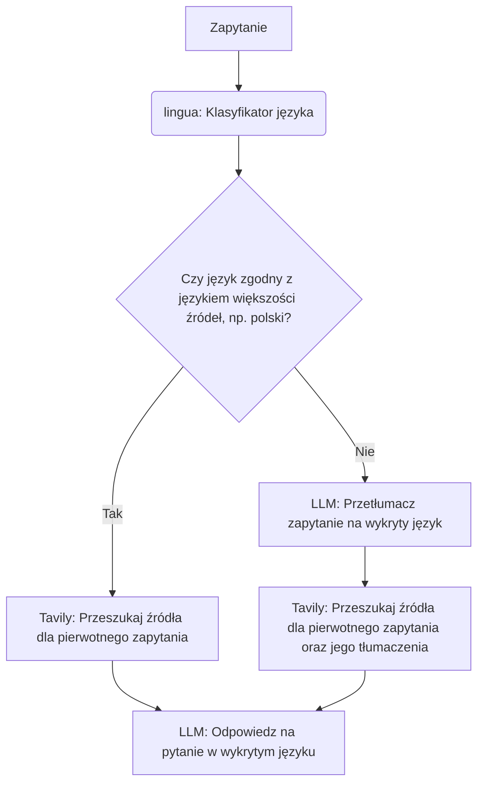

# Wstęp

Aplikacja jest adaptacją Asystenta Interesanta Gov.pl, stworzonego przez Jerzego Głowackiego i udostępnionego na licencji Apache 2.0 -- oryginalne źródło:

https://huggingface.co/spaces/jglowa/ai-gov.pl/tree/main

W umieszczonej w tym repozytorium wersji aplikacji zostały wprowadzone następujące zmiany:
* Przed odpowiedzią asystenta język zapytania jest ustalany przy użyciu biblioteki lingua-language-detection, a w zależności od wyniku, zapytanie jest tłumaczone w celu przeszukania źródeł oraz próba udzielenia odpowiedzi w wykrytym języku przez wstawienie języka do promptu.
* Dane dotyczące dodatkowych kroków (wykryty język, tłumaczenie zapytania) są zbierane przez Langfuse, jeśli jest wspierane.
* Szablony promptów wczytywane są z odrębnego katalogu prompts.
* W menu dodana jest opcja *Język* (domyślnie *Wykryj automatycznie*).
* Do listy modeli zostały dorzucone 2 modele komercyjne (GPT 4.1 mini, Mistral Small) i 3 małe modele do testów wymagające lokalnej instalacji (ollama).
* Błędy są inaczej obsługiwane - wyświetlane są w dymku jako odpowiedź bez zatrzymywania pracy aplikacji.
* Motyw Gradio jest ładowany z lokalnego pliku, aby przyspieszyć uruchamianie aplikacji.

Poza tym aplikacja zachowuje mniej więcej oryginalny kod z wyjątkiem dodanych komentarzy, w tym - aby zachować podobny do oryginału styl bez refaktoryzacji - poza lingua-language-detection celowo nie zostały użyte dodatkowe biblioteki (langgraph). Zachowany został również prosty styl promptów z oryginalnej aplikacji, dostosowany pod lokalne polskie modele językowe.

**Vibe coding:** Niektóre fragmenty kodu zostały wygenerowane lub zdebugowane przy użyciu Claude Code (model Opus 4.6).

**Ważne**: Projekt został wykonany hobbystycznie na użytek wewnętrzny autora, który nie poleca jego wdrożenia z uwagi na ryzyko i słabe strony wymienione w sekcji *Uwagi*.

# Mechanizm tłumaczenia

Mechanizm wykrywania języka i tłumaczenia jest przedstawiony poniżej. W promptach dodane zostały zmienne {language}.

Przykładowo:
* Większość informacji na temat profilu zaufanego jest opisanych w źródłach w języku polskim.
* Użytkownik pyta „How can I set up a Trusted Profile?”.
* Zapytanie jest tłumaczone na język polski: „Jak założyć profil zaufany?”
* Przeszukiwane są źródła zarówno dla tłumaczenia zapytania („Jak założyć profil zaufany?”), jak i dla oryginału („How can I set up a Trusted Profile?”).
* Odpowiedź AI jest udzielana w języku angielskim w oparciu o oba źródła.

Treści tłumaczone otrzymują niższy priorytet podczas selekcji źródeł (parametr TRANSLATION_PENALTY), z uwagi na to, że wiele źródeł w języku polskim dotyczy z założenia obywateli Polski, a źródła w języku obcym mogą być skierowane do obywateli z zagranicy (np. przepisy dotyczące obywateli Ukrainy). Użytkownika pytającego o profil zaufany w języku angielskim może interesować bardziej założenie takiego profilu przez osobę z zagranicy, co może być określone odrębnymi przepisami.

Ze względu na to, że lingua-language-detection obsługuje wyłącznie niektóre języki, lista wspieranych języków jest szeroka, ale zamknięta (parametr SUPPORTED_LANGUAGES).

Jeśli biblioteka Langfuse jest wspierana (wczytywane są dane środowiskowe LANGFUSE_BASE_URL, LANGFUSE_PUBLIC_KEY, LANGFUSE_SECRET_KEY), dodatkowe kroki wykrycia języka i przetłumaczenia zapytania są uwzględniane jako odrębne zakresy (span) w ramach śladu (trace).

# Uwagi

## Jakość tłumaczenia a wybrany model językowy

Mechanizm tłumaczenia działa niestety na akceptowalnym poziomie wyłącznie w wypadku modeli komercyjnych (API Mistral Small, API GPT 4.1 mini) oraz niektórych lokalnych modeli amerykańskich i chińskich. Dodatkowo w wypadku ręcznego wyboru języka działa on lepiej, jeśli zapytanie faktycznie zostanie postawione w wybranym języku.

Polskie modele językowe (PLLuM, Bielik) były trenowane i dostrajane na polskich danych, więc z założenia ich priorytetem nie jest udzielanie odpowiedzi w innych językach, a niekiedy mają one również kłopoty z tłumaczeniem zapytania na język polski (Bielik wypada tu lepiej niż PLLuM, który dostrojony został pod udzielanie odpowiedzi po polsku na pytania o tematyce urzędowo-prawnej). Projekt z uwagi na ograniczenia karty graficznej autora nie był sprawdzany na docelowych modelach Bielik-11B-v.3.0-instruct oraz PLLuM-12B-chat, ale zakwantyzowane wersje PLLuM-8B-instruct, PLLuM-8B-chat oraz Bielika-4.5B, choć radziły sobie porównywanie dobrze z odpowiedziami na pytania po polsku, udzielały słabej jakości i błędnych odpowiedzi na pytania wymagające skorzystania z mechanizmu tłumaczenia.

## Inne uwagi i roadmapa

Potencjalnym kompromisem bez odejścia od polskich modeli językowych mogłoby być zachowanie mechanizmu tłumaczenia pytania przed wyszukaniem źródeł, ale udzielanie odpowiedzi wyłącznie w języku polskim -- w ten sposób pytania zadane w innym języku prowadziłyby do bardziej wyczerpującej odpowiedzi po polsku, którą użytkownik mógłby samodzielnie przetłumaczyć przy użyciu innych źródeł (co poprawiałoby odpowiedzi w stosunku do oryginalnej wersji).

Innym potencjalnym rozwiązaniem mogłoby być ograniczenie wsparcia językowego do najmniej problematycznych języków (np. polski, ukraiński, angielski).

Projekt w razie potrzeby może zostać również dostosowany pod zupełnie inne źródła i modele językowe.

# Licencja

Podobnie jak w wypadku oryginalnego źródła, projekt jest udostępniony na licencji Apache 2.0.